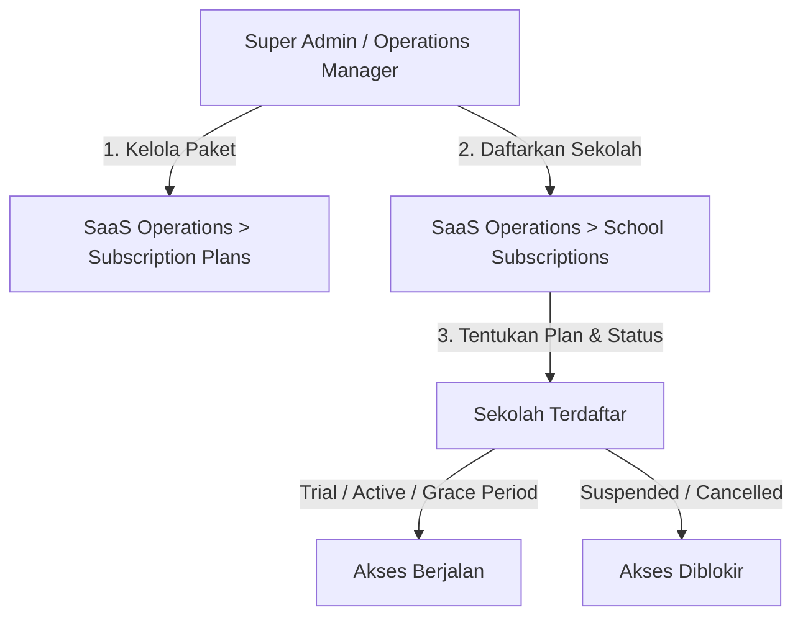

# Panduan Pengaturan Paket Berlangganan & Manajemen Modul

Dokumen ini menjelaskan alur kerja pengaturan paket berlangganan sekolah (SaaS subscription plans) serta cara mengelola modul yang aktif maupun modul yang dibatasi berdasarkan paket sekolah.

---

## 1. Alur Pengaturan Paket Berlangganan (Subscription Plan)

Paket berlangganan dikelola di level platform oleh **Super Admin** atau **Operations Manager** melalui menu **SaaS Operations**:

### A. Mengatur Tipe Paket (Subscription Plans)
Akses menu ini melalui **SaaS Operations > Subscription Plans** (`route('saas-ops.subscription-plans.index')`). Di sini Anda dapat membuat paket baru dengan data:
* **Code**: Kode unik plan (contoh: `basic`, `pro`, `premium`).
* **Name**: Nama paket (contoh: "Paket Hemat", "Paket Lengkap").
* **Monthly/Yearly Price**: Harga berlangganan per bulan/tahun.
* **Features**: List fitur yang disertakan (dimasukkan per baris baru, disimpan sebagai JSON Array).

### B. Mengelola Langganan Sekolah (School Subscriptions)
Akses menu ini melalui **SaaS Operations > School Subscriptions** (`route('saas-ops.school-subscriptions.index')`). Di sini Anda mengaitkan sekolah aktif ke paket tertentu:
* **Tambah Langganan**: Pilih Sekolah, Pilih Plan, tentukan status awal (`trial`, `active`, dll.) dan atur tanggal kadaluarsa.
* **Aksi Lifecycle**:
  * **Activate**: Mengaktifkan langganan (mengubah status menjadi `active` dan memperbarui tanggal masa aktif).
  * **Suspend**: Menangguhkan akses sekolah (misalnya karena telat bayar) dengan memberikan alasan penangguhan. Sekolah yang disuspend tidak akan bisa diakses sama sekali.
  * **Cancel**: Membatalkan langganan sekolah secara permanen.

---

## 2. Alur Pengelolaan Modul & Pembatasan

Platform HafizPlus menyediakan sistem modular di mana fitur-fitur seperti *Tahfizh*, *Mutabaah*, *Kehadiran*, *Keuangan*, *Boarding*, dan *Cashless* dapat diaktifkan atau dinonaktifkan secara dinamis per sekolah.

### A. Tabel Konfigurasi Modul di Database

| Nama Tabel | Peran & Ruang Lingkup | Dikelola Oleh | Lokasi Menu di UI |
| :--- | :--- | :--- | :--- |
| `saas_subscription_plans` | Menyimpan daftar fitur teoretis (deskriptif) per plan. | Super Admin | SaaS Operations > Subscription Plans |
| `tenant_modules` | Menyimpan status aktif (`is_enabled`) dan konfigurasi modul riil per sekolah. | Admin Sekolah / Super Admin | Tenancy > Tenant Modules |
| `system_modules` | Menyimpan registrasi modul secara global di platform. | Super Admin | SchoolOS > Module Registry |

### B. Cara Mengaktifkan / Menonaktifkan Modul Sekolah
Untuk mengelola modul yang aktif bagi sekolah Anda:
1. Masuk sebagai **Admin Sekolah** atau **Super Admin**.
2. Buka menu **Tenancy > Tenant Modules** (`route('tenancy.modules.index')`).
3. Pada grid modul yang tampil (contoh: *Tahfizh*, *Cashless*, *LMS*), klik tombol **Nonaktifkan Modul** atau **Aktifkan Modul**.
4. Modul yang dinonaktifkan akan secara otomatis menyembunyikan link menu terkait dari sidebar dan menolak pemrosesan di mobile API.

---

## 3. Matriks Status Langganan & Dampak Akses

| Status Langganan | Dampak Terhadap Web Portal (Browser) | Dampak Terhadap Aplikasi Mobile (API) |
| :--- | :--- | :--- |
| **trial** | Akses penuh sesuai modul yang diaktifkan di `tenant_modules`. | Akses penuh sesuai token login dan peran. |
| **active** | Akses penuh sesuai modul yang diaktifkan di `tenant_modules`. | Akses penuh. |
| **grace_period** | Akses tetap terbuka dengan peringatan tenggat waktu pembayaran. | Akses tetap terbuka. |
| **suspended** | **Akses Diblokir Total**. Muncul error: `403 Tenant sekolah sedang tidak aktif`. | **Akses Diblokir Total**. API mengembalikan error response. |
| **cancelled** | **Akses Diblokir Total**. | **Akses Diblokir Total**. |
| **expired** | **Akses Diblokir Total** setelah masa tenggang habis. | **Akses Diblokir Total**. |
